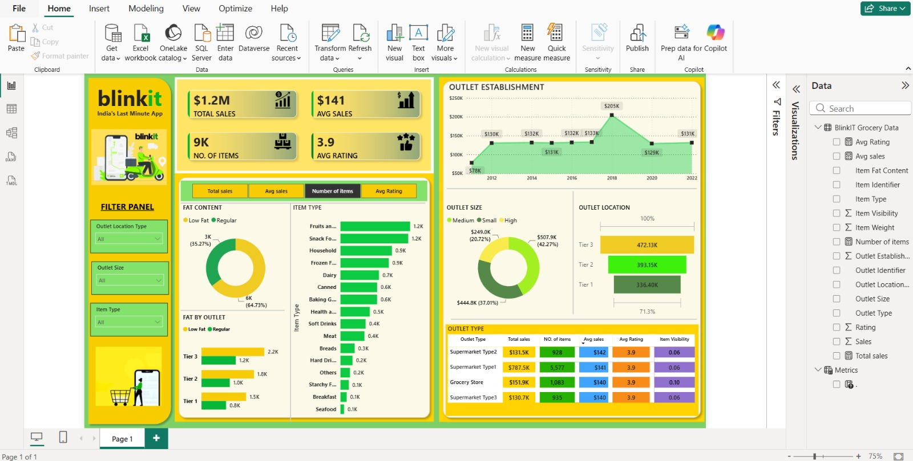

# 🛒 Blinkit Sales Analysis Dashboard | Power BI

## 📌 Project Overview

This project is an interactive Power BI dashboard built to analyze Blinkit's sales performance, customer satisfaction, and inventory distribution. The dashboard helps identify sales trends, outlet performance, product categories, and customer ratings to support business decision-making.

---

## 🎯 Business Objectives

- Analyze overall sales performance.
- Compare sales across different outlet types and locations.
- Evaluate product performance by item type and fat content.
- Monitor customer ratings and inventory distribution.
- Build an interactive dashboard for business users.

---

## 📊 Key Performance Indicators (KPIs)

- 💰 Total Sales
- 📈 Average Sales
- 📦 Number of Items Sold
- ⭐ Average Customer Rating

---

## 📈 Dashboard Features

- Total Sales by Fat Content
- Total Sales by Item Type
- Fat Content Analysis by Outlet
- Sales by Outlet Establishment Year
- Sales Distribution by Outlet Size
- Sales by Outlet Location
- Performance Comparison by Outlet Type
- Interactive Filters (Outlet Size, Outlet Location, Item Type)

---

## 🛠 Tools & Technologies

- Power BI Desktop
- Power Query
- DAX (Data Analysis Expressions)
- Data Modeling
- Microsoft Excel

---
## 📷 Dashboard Preview

---

## 📌 Key Insights

- Medium-sized outlets generated the highest sales.
- Tier 3 locations contributed the largest share of revenue.
- Fruits & Vegetables and Snack Foods were the top-performing categories.
- Regular-fat products generated higher sales than low-fat products.
- Supermarket Type 1 recorded the highest overall sales.

---

## 📂 Repository Contents

- 📄 Blinkit Dashboard.pbix
- 📊 Blinkit Grocery Data.xlsx
- 🖼 Dashboard Screenshot
- 📘 README.md

---

## 🚀 Skills Demonstrated

- Data Cleaning
- Data Transformation
- DAX Measures
- Data Modeling
- Dashboard Design
- Business Intelligence
- Data Visualization
- Interactive Reporting

---

## 👤 Author

**Sanjeev Kumar Yadav**

If you found this project useful, feel free to ⭐ the repository.

**Sanjeev Kumar Yadav**

If you found this project useful, feel free to ⭐ the repository.
